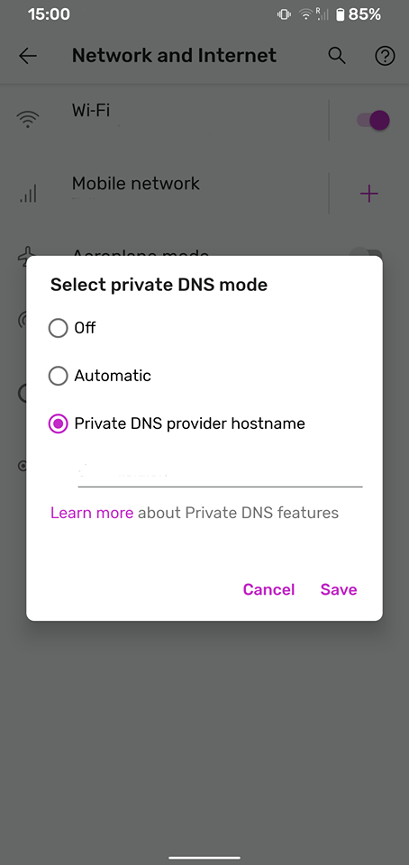

= Pi hole DoT Experiment
:toc: macro
:toclevels: 4

link:https://docs.pi-hole.net/['Pi-hole®'] is a DNS sinkhole that protects your devices from unwanted content, without installing any client-side software.

This experiment is to investigate and implement if possible) a full Pihole with DNS over TLS (DoT) in order to fully protect the DNs chain, from the client source to the server themselves.  This allow phones (especially the ones with android 9 and above - other phones require a bit more work but it works too) as well as any regular computer to automatically block all advertisements, trakcers and malicious websites while browsing the internet.

<<<

toc::[]

<<<

## Requirements

For this setup, we will need the two following items:

- A standard fully qualified domain name (e.g: example.com) from your favorite domain provider.
- A machine somewhere on the internet or on your local network (e.g: Raspberry pie or a standard VM)

## Setup

Our setup consist of a single tiny GCE machine in a GCP project.
The machine is a Ubuntu 18.04.03 LTS from the standard images from the Google library.

Note here we use a project not connected to any production network for added security in case of a compromise.

### Static IP & Firewall

In order for the Pihole to be reachable from the outside, one need to assign a static IP. link:https://console.cloud.google.com/networking/addresses/list?project=security-elisiac-playground2&addressesTablesize=50[`Google Cloud External IP addresses configuration`] page allows us to transform the ephemeral IP into a static one by simply requesting for it.

We then need to link:https://console.cloud.google.com/networking/firewalls/list?project=security-elisiac-playground2[`open a few ports`] from the default deny-all configuration.

- (optional) 22: Allow access to SSH (Note: You will need to transfer your SSH key to the machine. You can do that by SSH-ing at least one time via the Google Console interface)
- 53 TCP+UDP: Default DNS port
- 80 TCP: Web HTTP port
- 443 TCP: Web HTTPS port
- 853 TCP+UDP: TLS answer port for DNS over TLS (DoT)

We allow the internet to send queries to it by adding the IP range: `0.0.0.0/0`. The rest can be left as default.

### Add a A record for your domain

The last part of our preparation will be to add an A record for a subdomain on your current DNS provider where XXX.XXX.XXX.XXX is the static IP of your machine.

This will allow us to contact our pihole without having to use the IP address and will be required for DoT. Below is an example of a record (with a TLL of 4h):

```
Domain               TTL     Type  Target
pihole.example.com.  14440   A     XXX.XXX.XXX.XXX
```

### Pihole installation

Once done, it is time to install Pihole. They have link:https://docs.pi-hole.net/[`great documentation`] already available and I highly recomment to follow it. I'll copy here the part I need for this tutorial.

On the Pihole repository, they  prepared a one line instruction script that will do all the work. It is the most critical and dangerous part of the process as executing random scripts from the internet is never recommended. Make sure you are comfortable killing this machine if need be. Please do *not* install this into a critical production environment.


The line below should resolve to the gihub file: https://github.com/pi-hole/pi-hole/blob/master/automated%20install/basic-install.sh. Have a look at the file and make sure it is all right.

When you are ready, simply run:

```bash
curl -sSL https://install.pi-hole.net | sudo bash
```

Follow the instructions on the screen and select your upstream provider. I usually choose Cloudflare (as we will use their upstream for DNS over HTTPS). See below.

At the end of the process, you will need to remember the IP of your machine as well as the password written on the screen. You will need it to be able to access the web interface using:

```html
http://xxx.xxx.xxx.xxx/admin
```

If you can see the interface, great! It means you have done it right:


You can already login an explore the interface from there. We'll continue by adding a couple of treats on top of the default installation.

### Changing password if needed:

In case you have lost your password or you would like ot change it, here is the command you need to type in your SSH terminal. then simply enter your new password twice.

```bash
$ pihole -a -p
Enter New Password (Blank for no password):
Confirm Password:
[✓] New password set
```

### Getting SSL certificates

As we have already configured our subdomain above, we are now ready to harden our installation by using only HTTPS to access the interface.

Ensure that your subdomain is reachable and resolve to the IP of your machine:

```bash
$ dig pihole.example.com

; <<>> DiG 9.11.3-1ubuntu1.11-Ubuntu <<>> pihole.example.com
;; global options: +cmd
;; Got answer:
;; ->>HEADER<<- opcode: QUERY, status: NOERROR, id: 11204
;; flags: qr rd ra; QUERY: 1, ANSWER: 1, AUTHORITY: 0, ADDITIONAL: 1

;; OPT PSEUDOSECTION:
; EDNS: version: 0, flags:; udp: 4096
;; QUESTION SECTION:
;pihole.example.com.			IN	A

;; ANSWER SECTION:
pihole.example.com.		3600	IN	A	XXX.XXX.XXX.XXX

;; Query time: 356 msec
;; SERVER: 1.1.1.1#53(1.1.1.1)
;; WHEN: Sun Dec 22 18:30:34 CET 2019
;; MSG SIZE  rcvd: 58
```

It seems all good so we can now use link:https://letsencrypt.org/docs/client-options/[`Let's encrypt SSL certificates`] to generate one for out machine.

For that we will use Certbot, following the link:https://certbot.eff.org/instructions[`official instructions`] (copied below of conveninence. Please refer to their instruction for the most up-to-date version).

```bash
# Add the repository
sudo apt-get update
sudo apt-get install software-properties-common
sudo add-apt-repository universe
sudo add-apt-repository ppa:certbot/certbot
sudo apt-get update

# Install certbot
sudo apt-get install certbot
```

Make sure that the default webserver for the pihole is running (lighthttpd):
```bash
$ service lighttpd status
● lighttpd.service - Lighttpd Daemon
   Loaded: loaded (/lib/systemd/system/lighttpd.service; enabled; vendor preset: enabled)
   Active: active (running) since Sun 2019-12-22 15:57:17 UTC; 1h 50min ago
 Main PID: 20524 (lighttpd)
    Tasks: 6 (limit: 4395)
   CGroup: /system.slice/lighttpd.service
           ├─20524 /usr/sbin/lighttpd -D -f /etc/lighttpd/lighttpd.conf
           ├─20550 /usr/bin/php-cgi
           ├─20553 /usr/bin/php-cgi
           ├─20554 /usr/bin/php-cgi
           ├─20555 /usr/bin/php-cgi
           └─20557 /usr/bin/php-cgi

Dec 22 15:57:17 pihole-experiment systemd[1]: Starting Lighttpd Daemon...
Dec 22 15:57:17 pihole-experiment systemd[1]: Started Lighttpd Daemon.
Dec 22 15:57:37 pihole-experiment sudo[20579]: www-data : TTY=unknown ; PWD=/var/www/html/admin ; USER=root ; COMMAND=/usr/local/bin/pihole status web
Dec 22 15:57:37 pihole-experiment sudo[20579]: pam_unix(sudo:session): session opened for user root by (uid=0)
Dec 22 15:57:37 pihole-experiment sudo[20579]: pam_unix(sudo:session): session closed for user root

```

Now, we can generate the certificate for our setup with the following command:
```bash
sudo certbot certonly --webroot -w /var/www/html/ -d pihole.example.com
```
Note:

* -w : Path of Lighthttpd default web root
* -d : Fully Qualified Domain Name

You should see a similar success message:
```bash
$ sudo certbot certonly --webroot -w /var/www/html/ -d pihole.example.com

Saving debug log to /var/log/letsencrypt/letsencrypt.log
Plugins selected: Authenticator webroot, Installer None
Obtaining a new certificate
Performing the following challenges:
http-01 challenge for pihole.example.com
Using the webroot path /var/www/html for all unmatched domains.
Waiting for verification...
Cleaning up challenges

IMPORTANT NOTES:
 - Congratulations! Your certificate and chain have been saved at:
   /etc/letsencrypt/live/pihole.example.com/fullchain.pem
   Your key file has been saved at:
   /etc/letsencrypt/live/pihole.example.com/privkey.pem
   Your cert will expire on 2020-03-21. To obtain a new or tweaked
   version of this certificate in the future, simply run certbot
   again. To non-interactively renew *all* of your certificates, run
   "certbot renew"
 - If you like Certbot, please consider supporting our work by:

   Donating to ISRG / Let's Encrypt:   https://letsencrypt.org/donate
   Donating to EFF:                    https://eff.org/donate-le
```

Fantastic! We now have our SSl certificates!

Let's complete this by making sure we have these auto-renewed by default by the certbot. Run the command below to make sure the cron that has been automatically installed is configured properly and will do its work without assistance.

```bash
sudo certbot renew --dry-run
```

### Lighthttpd configuration

Now that we have our certificates, let's activated them on our web-interface. The lighttpd web-server will need a custom configuration to enable the SSL engine. We will configure this in the `/etc/lighttpd/external.conf` file (do not use `/etc/lighttpd/lighttpd.conf` as it will be overwritten when running a Pihole update).

To start, lighttpd expects to see an `ssl.pemfile` so we'll need to create it by combining the certificates files we just created. Use the following command:

```bash
sudo cat /etc/letsencrypt/live/pihole.example.com/privkey.pem \
         /etc/letsencrypt/live/pihole.example.com/cert.pem \
  | sudo tee /etc/letsencrypt/live/pihole.example.com/combined.pem
```

As this is a manual step and Let's encrypt will not do the combination for us, we'll need to add this line in the CRON job created for the certbot. Edit the file `/etc/cron.d/certbot` and add the following line:

```
1 */12 * * * root cat /etc/letsencrypt/live/pihole.example.com/privkey.pem /etc/letsencrypt/live/pihole.example.com/cert.pem | tee /etc/letsencrypt/live/pihole.example.com/combined.pem
```

Now we make sure Lighthttpd can access these files:
```bash
sudo chown www-data -R /etc/letsencrypt/live
```
Finally, we write the following in the `/etc/lighttpd/external.conf` file:

```
$HTTP["host"] == "pihole.example.com" {
  # Ensure the Pi-hole Block Page knows that this is not a blocked domain
  setenv.add-environment = ("fqdn" => "true")

  # Enable the SSL engine with a LE cert, only for this specific host
  $SERVER["socket"] == ":443" {
    ssl.engine = "enable"
    ssl.pemfile = "/etc/letsencrypt/live/pihole.example.com/combined.pem"
    ssl.ca-file =  "/etc/letsencrypt/live/pihole.example.com/fullchain.pem"
    ssl.honor-cipher-order = "enable"
    ssl.cipher-list = "EECDH+AESGCM:EDH+AESGCM:AES256+EECDH:AES256+EDH"
    ssl.use-sslv2 = "disable"
    ssl.use-sslv3 = "disable"
  }

  # Redirect HTTP to HTTPS
  $HTTP["scheme"] == "http" {
    $HTTP["host"] =~ ".*" {
      url.redirect = (".*" => "https://%0$0")
    }
  }
}
# Redirect HTTP to HTTPS by default
$HTTP["scheme"] == "http" {
  $HTTP["host"] == "pihole.example.com" { # HTTP URL
    url.redirect = ("/.*" => "https://pihole.example.com$0") # Redirection HTTPS URL
  }
}
```

Now simply restart the web-server as follow:
```bash
sudo service lighttpd restart
```

You will now be able to access the web-interface using your `https://pihole.example.com` and will be automatically redirected when needed.

## DNS over TLS

Now that we have our web interface up and running, we can prepare our Pihole to accept  DNS over TLS (DoT).
[quote, Wikipedia, DNS over TLS (DoT)]
DNS over TLS (DoT) is a security protocol for encrypting and wrapping Domain Name System (DNS) queries and answers via the Transport Layer Security (TLS) protocol. The goal of the method is to increase user privacy and security by preventing eavesdropping and manipulation of DNS data via man-in-the-middle attacks.

Note: One could also setup DNS over HTTPS (DoH) but on top of having a bigger overhead (HTTPS conversion), Android 9+ only support natively private DNS via DoT so we will not cover it in this document.

In order to implement DoT, we will simply proxy our request from our secure port 853 to our regular DNS port, 53.

We would love to be able to leverage our lighthttpd but unfortunately, the link:https://redmine.lighttpd.net/projects/1/wiki/Docs_ModProxy[`current version of lighthttpd_proxy`] does not support SSL/TLS connection over backend.

To do so, we will thus use Ngnix. First, we need to install Ngnix with the regular command:

```bash
sudo apt install ngnix
```

By default, it will be installed with a web-server configuration and will try to serve pages on port 80. As we already have lighthttpd doing so, it will not work properly until fixed.

Let's start with creating a directory to handle our "streams" of requests:
```bash
sudo mkdir /etc/nginx/streams/
```

We can now create the configuration file `/etc/nginx/streams/dns-over-tls` and prepare it to proxy our query to our pihole server:

```bash
upstream dns-servers {
  server  127.0.0.1:53;
}

server {
  listen 853 ssl; # managed by Certbot
  ssl_certificate /etc/letsencrypt/live/pihole.example.com/fullchain.pem; # managed by Certbot
  ssl_certificate_key /etc/letsencrypt/live/pihole.example.com/privkey.pem; # managed by Certbot
  ssl_dhparam /etc/letsencrypt/ssl-dhparams.pem; # managed by Certbot


  ssl_protocols        TLSv1.2 TLSv1.3;
  ssl_ciphers          HIGH:!aNULL:!MD5;

  ssl_handshake_timeout    10s;
  ssl_session_cache        shared:SSL:20m;
  ssl_session_timeout      4h;

  proxy_pass dns-servers;
}
```

Note: We'll copy our let'sencrypt parameters file to the right place for convenience:
```bash
sudo cp /usr/lib/python3/dist-packages/certbot/ssl-dhparams.pem /etc/letsencrypt/
```

We now can tell Nginx to use our new configuration file by editing `/etc/nginx/nginx.conf` and adding:

```
stream {
        include /etc/nginx/streams/*;
}
```

Note: You should also delete the entire `web` section of the configuration file as we do not need it.
You can now restart Ngnix:
```bash
sudo systemctl restart nginx
```

You can now test your configuration with this website: https://getdnsapi.net/query/ and see if your TLS configuration is working properly.

## DNS over HTTPS

Now that we have secured query from the client to your pihole. But pihole itself will still make queries in order to resolve domains and send them back to you. These queries are not encrypted and thus, whomever you use as an ISP for your VM to the DNS you want to reach can read these queries.

Follow the very good guide of pi-hole.net: https://docs.pi-hole.net/guides/dns-over-https/ in order to setup the configuration.


# Configure your Android 9+

You can now use the Private DNS provider configuration in Android 9+ in order to use your pihole:




Set the value of the field with the domain name of your pihole and that it is. Your phone will now only use this DNS to make queries, regardless if it is on Wifi or Network connection.